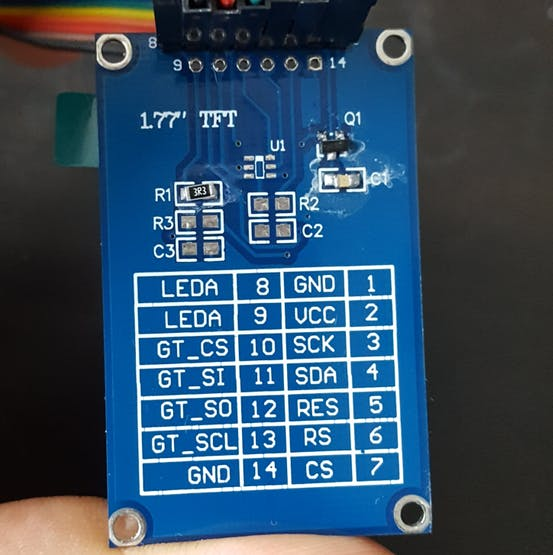
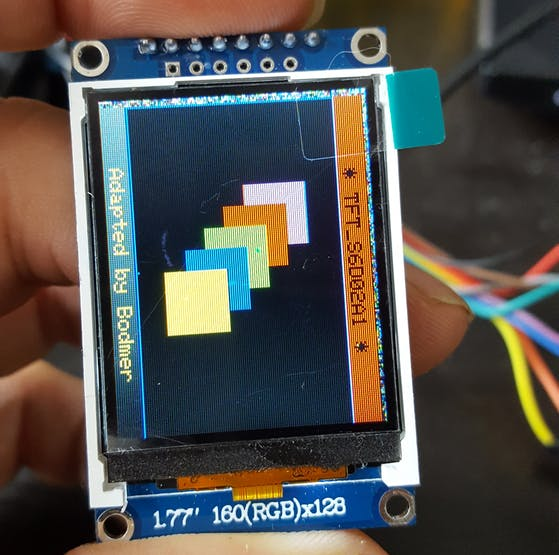

# TFT 160x128 1.77"

Скетч теста подсмотрен [здесь](https://github.com/adafruit/Adafruit-ST7735-Library/blob/master/examples/graphicstest/graphicstest.ino)
- - -

## Схема подключения

| Display (Pin) | Arduino Nano |
|--------|--------|
|GND  (1) | GND|
|VCC  (2) | 5V|
|SCK  (3) | D13|
|SDA  (4) | D11|
|RES  (5) | D8|
|RS   (6) | D9|
|CS   (7) | D10|
|LEDA (8) | 3.3V|

5V лучше взять не от платы, а от другого стабильного источника.